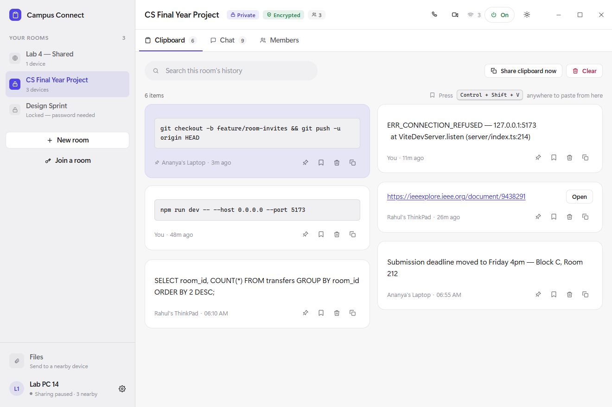
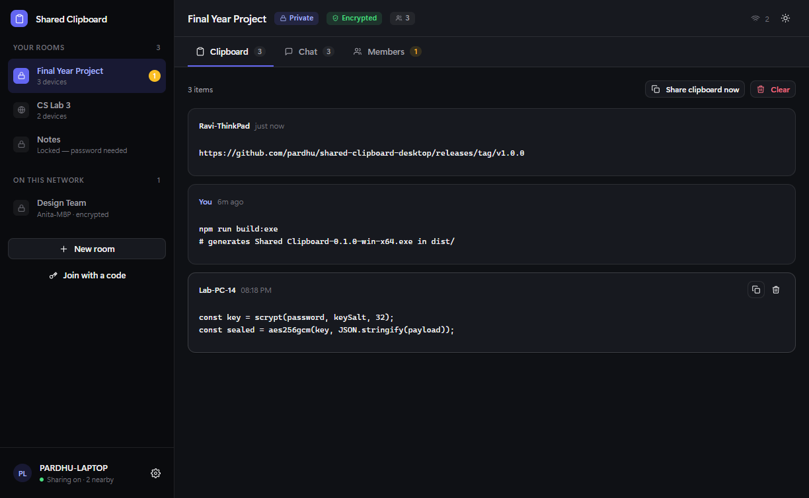
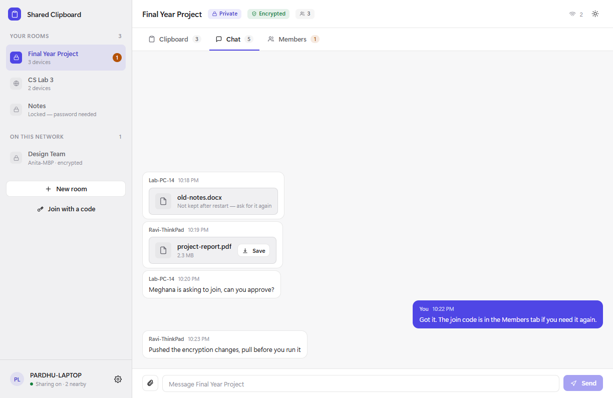
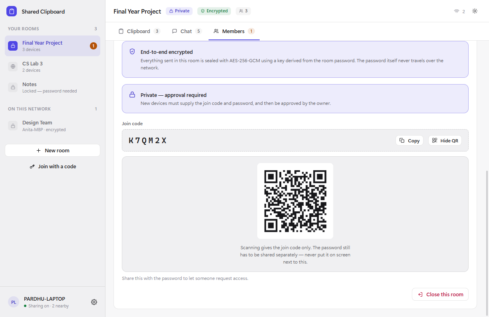
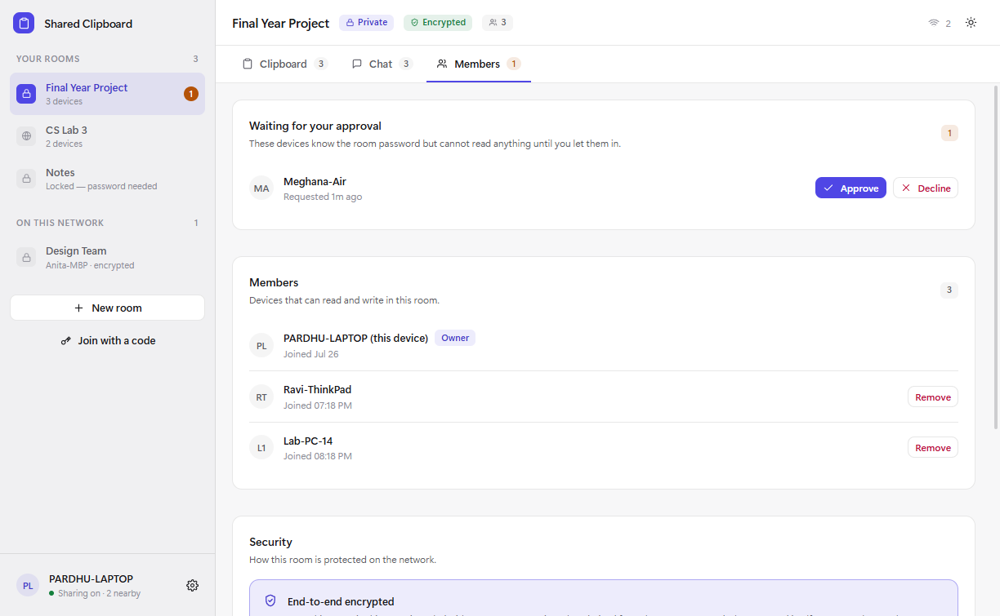
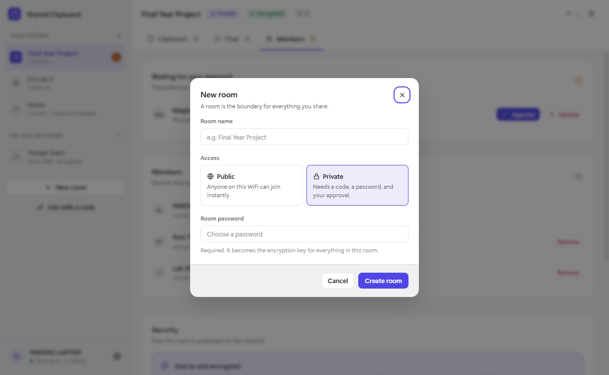
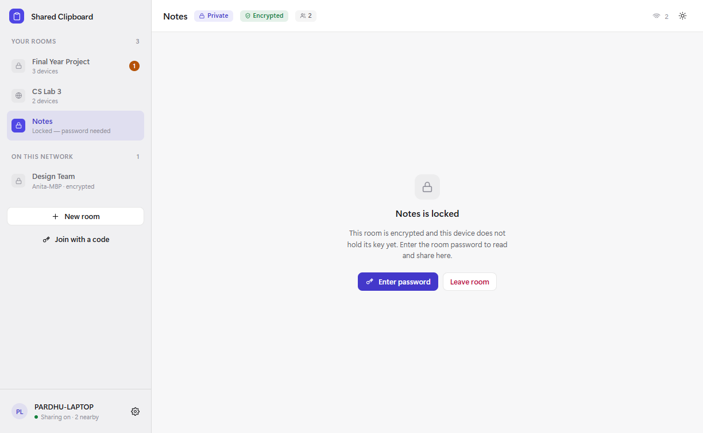
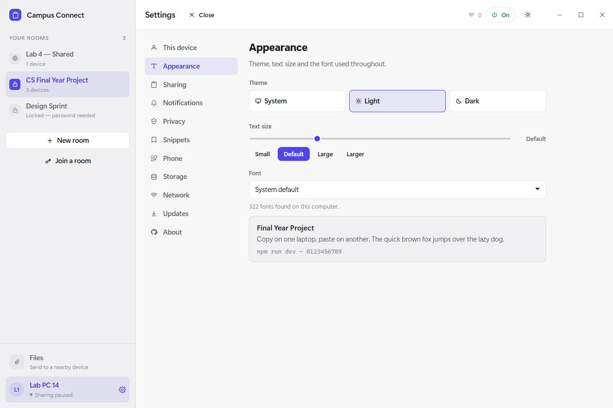

<div align="center">

# Shared Clipboard

**Copy on one laptop. Paste on another.**

An encrypted, room-based clipboard and chat for devices on the same network.
No cloud, no account, no data leaving your WiFi.

[](https://github.com/Vijayapardhu/Clipboard/actions/workflows/ci.yml)
[](LICENSE)
[](#installing)
[](CONTRIBUTING.md)

[**Website**](https://vijayapardhu.github.io/Clipboard/) ·
[**Architecture**](ARCHITECTURE.md) ·
[**Contributing**](CONTRIBUTING.md) ·
[**Security**](SECURITY.md)



</div>

---

## The problem

You are on a lab machine and you need a link from your own laptop. So you email
it to yourself. Or you message it to yourself on WhatsApp. Or you type out a
forty-character URL by hand and get one character wrong.

Everyone does this several times a day, and every workaround sends your
clipboard to a server that has no business seeing it.

**Shared Clipboard** removes the round trip. Copy on one machine, press `Ctrl+V`
on the other. Nothing leaves the network you are already on.

---

## What it does

- **Real-time clipboard sync** — text and images, across Windows, macOS and Linux
- **Rooms** decide who sees what. You are only ever sharing into one room at a time
- **End-to-end encryption** with AES-256-GCM, keyed by a password you choose
- **Approval-based private rooms** — the owner decides who gets in
- **Invite devices directly** — see who is on the network and invite them, instead
  of reading a code out loud
- **Built-in chat**, per room, with **file transfer** up to 50 MB and
  **delivered / seen** markers
- **Notifications** when something arrives while the window is closed
- **Stays small on disk** — attachments are cleaned up on a schedule, the text is kept
- **Large transfers** — multi-megabyte images are chunked and reassembled, with
  automatic retransmission of anything the network drops
- **Clipboard history** that survives restarts, with search, pinning, and one-click copy back
- **QR codes** for join codes, so a phone can scan instead of typing
- **Two transports** — UDP for discovery, direct TCP for networks that filter it
- **No account, no server, no internet connection required**
- **Adjustable text size and font**, light and dark themes, keyboard shortcuts

---

## Who it is for

<table>
<tr>
<td width="50%" valign="top">

### Students

You have a laptop, the lab has a desktop, and your project needs both. Move
error messages, Stack Overflow links, API keys and code snippets between them
without emailing yourself.

Working in a group? Make a room for the team. Everyone's clipboard becomes a
shared scratchpad for the afternoon — and when the session ends, close the room
and it is gone.

</td>
<td width="50%" valign="top">

### Office and remote teams

Pair programming, shared debugging, moving a config value from a laptop to a
test machine. A private room with a password keeps it inside the room even
though everyone is on the same office WiFi.

For anyone handling things that should not touch a third-party server —
credentials, internal URLs, customer data — the fact that nothing leaves the
local network is the entire point.

</td>
</tr>
<tr>
<td width="50%" valign="top">

### Anyone with more than one machine

Desktop and laptop. Work machine and personal machine. A Windows box and a Linux
box under the same desk. One public room, no password, and your clipboard
follows you between them.

</td>
<td width="50%" valign="top">

### Classrooms and workshops

An instructor can put a command or a link into a public room and thirty people
have it instantly, without reading it out character by character while everyone
mistypes it.

</td>
</tr>
</table>

---

## Screenshots

<table>
<tr>
<td width="50%"><br><em>Clipboard history, dark mode</em></td>
<td width="50%"><br><em>Per-room chat with file transfer</em></td>
</tr>
<tr>
<td><br><em>Scannable join codes</em></td>
<td><br><em>Search and pinned items</em></td>
</tr>
<tr>
<td><br><em>Approval queue and member management</em></td>
<td><br><em>Creating a private, encrypted room</em></td>
</tr>
<tr>
<td><br><em>An encrypted room this device has no key for</em></td>
<td><br><em>Theme, text size and system font picker</em></td>
</tr>
</table>

---

## Installing

### From an installer

Grab the latest build for your platform from the
[Releases page](https://github.com/Vijayapardhu/Clipboard/releases).

| Platform | File |
|----------|------|
| Windows 10/11 | `SharedClipboard-x.y.z-win-x64.exe` |
| macOS (Intel and Apple silicon) | `SharedClipboard-x.y.z-mac-universal.dmg` |
| Ubuntu / Linux | `SharedClipboard-x.y.z-linux-x86_64.AppImage` |

### "Unknown publisher" — is it safe?

Windows will show **"Microsoft Defender SmartScreen prevented an unrecognized
app from starting — Publisher: Unknown publisher"**, and macOS will refuse the
first launch. This is expected and it is not a claim that anything is wrong with
the file.

Windows reads the publisher name out of a **code-signing certificate**. This
project does not have one yet, so the field is blank — that is all the warning
means. The file itself is fully attributed: right-click it, choose
**Properties → Details**, and it says `Vijaya Pardhu`.

To run it anyway:

| Platform | What to do |
|----------|-----------|
| Windows | **More info → Run anyway** |
| macOS | Right-click the app → **Open** → **Open** |
| Ubuntu | `chmod +x SharedClipboard-*.AppImage` then run it |

If you would rather not take that on trust, **[build it from
source](#from-source)** — it takes a minute, and then the binary is one you
compiled yourself. That is the honest answer, and it is why the whole thing is
readable in an afternoon.

Signing is already wired into the release workflow, so this goes away as soon as
a certificate is in place.

### From source

Requires [Node.js 20+](https://nodejs.org).

```bash
git clone https://github.com/Vijayapardhu/Clipboard.git
cd Clipboard
npm install
npm run dev            # run it
npm run build:exe      # or build a Windows installer into release/
```

---

## Using it

### 1. Make a room

Rooms are the privacy boundary. Nothing is shared outside the room you have
selected.

| Room type | Who can join | Encrypted |
|-----------|-------------|-----------|
| **Public**, no password | Anyone on the network, instantly | No — plain text |
| **Public**, with password | Anyone who knows the password | AES-256-GCM |
| **Private** | Join code **or** password, then owner approval | AES-256-GCM |

You do not need both credentials for a private room — whichever one you were
given works. That matters when the code is awkward to pass on.

One caveat worth knowing: the password is what decrypts the room. Joining with
only the join code gets you in, but the room shows as **Locked** until you enter
the password. The app tells you this before you submit.

For anything you would not shout across the room, use a private room.

### 2. Bring in the other device

Open the app on the second machine. Rooms on the network appear under **On this
network**. Click one, enter the join code and password, and wait to be approved.
If it does not appear, use **Join with a code**.

### 3. Copy and paste

That is it. Copy on one machine, `Ctrl+V` on the other. Copied items build up in
the room's history, so you can go back and re-copy something from an hour ago.

### Handy details

- **Pause sharing** from the tray icon or Settings when you are about to copy a
  password.
- **Turn off automatic pasting** if you would rather items only collect in
  history until you pick one.
- **Remove someone** from a room at any time in the **Members** tab. They stop
  being able to read new messages immediately.
- **Leave or close a room** from the same tab. Closing it removes it for everyone.

---

## How the security actually works

This is worth understanding, because "encrypted" gets claimed a lot.

```
  Your password  ──scrypt(N=32768)──▶  32-byte room key
       │                                      │
       │  never leaves this device            │
       ▼                                      ▼
  never transmitted            AES-256-GCM(key, payload)
                                              │
                                              ▼
                              { iv, ciphertext, auth tag }  ──▶ network
```

**The password is never sent.** It only ever feeds `scrypt` locally. When you
ask to join a room, your device seals a known phrase with the derived key and
sends *that*. The owner opens it with their own key: only someone who knows the
password could have produced something the owner can open. The proof is tied to
the room's id, so a proof captured from one room cannot be replayed at another.

**Four checks before anything is applied.** An incoming packet is only acted on
when the room exists here, *you* are an accepted member, the *sender* is an
accepted member, and the payload actually decrypts. Anything else is dropped.

**Tampering is detected, not just decryption failure.** GCM's authentication tag
means a modified packet is rejected outright rather than quietly producing
garbage.

**The owner is the source of truth** for who is in a room. Remove someone and
every device updates; they cannot read anything sent afterwards.

Everything the project deliberately does **not** protect against — public room
names, traffic analysis, keys cached on disk — is written down honestly in
[SECURITY.md](SECURITY.md). Section 5 of [ARCHITECTURE.md](ARCHITECTURE.md) has
the full design.

---

## Built with

| Layer | Choice | Why |
|-------|--------|-----|
| Shell | [Electron](https://electronjs.org) 35 | One codebase, three desktop platforms, real clipboard access |
| Language | [TypeScript](https://typescriptlang.org) 5.8, strict | The wire protocol is easy to get wrong; types catch a lot of it |
| Interface | [React](https://react.dev) 19 | Familiar, and the whole UI is state-driven |
| Bundler | [Vite](https://vitejs.dev) 6 | Fast dev server, small production build |
| Transport | Node `dgram` (UDP) | No broker, no server — just broadcast on the LAN |
| Crypto | Node `crypto` — scrypt + AES-256-GCM | Standard library only. No crypto dependency to audit or trust |
| Storage | `electron-store` | Rooms, keys and history as plain JSON |
| Packaging | `electron-builder` | NSIS, DMG and AppImage from one config |

**No external networking or cryptography libraries.** Everything security-related
uses the Node standard library, which makes it possible to actually read and
verify all of it in an afternoon.

---

## Project layout

```
src/
├── main/            Electron main process — network, crypto, storage
│   ├── main.ts          Lifecycle, UDP protocol, IPC handlers
│   ├── crypto.ts        scrypt, AES-256-GCM, join codes, proofs
│   ├── roomManager.ts   Rooms, keys, membership, discovery
│   └── historyManager.ts
├── renderer/        React interface
│   ├── App.tsx          Root component and state
│   ├── panels.tsx       Clipboard / Chat / Members
│   ├── modals.tsx       Create, Join, Unlock, Settings
│   └── styles.css       Design tokens and every component style
└── shared/          Types and the IPC contract, used by both processes
test/                Test suite (plain Node, no framework)
docs/                The GitHub Pages site
```

---

## Development

```bash
npm run dev          # TypeScript watch + Vite + Electron
npm run typecheck    # Both projects
npm test             # 29 assertions over crypto, rooms and history
npm run build        # Compile to dist/
npm run build:exe    # Windows installer into release/
```

The security-critical modules import nothing from Electron, so they run in plain
Node:

```
$ npm test

-- crypto --
  PASS  wrong key cannot open the envelope
  PASS  tampered ciphertext is rejected by the auth tag
  PASS  nonce is unique across seals (no IV reuse)
  PASS  proof verifies only with the correct password
  PASS  a proof for one room does not verify for another
  PASS  join code alphabet is uniformly distributed (no modulo bias)
  ...
-- rooms --
  PASS  the advert leaks neither the roster nor the join code
  PASS  the owner cannot be removed from their own room
  PASS  a removed member loses access
  ...

29 passed, 0 failed
```

---

## Roadmap

Shipped:

- [x] **Chunked transfer** so large screenshots sync, with NACK-based retransmission
- [x] **File transfer** in chat, up to 50 MB
- [x] **QR codes** for join codes so phones can scan them
- [x] **Pinned clipboard items** that survive the history cap
- [x] **Search** across clipboard history
- [x] **Keyboard shortcuts** — `Ctrl+1..9` for rooms, `Ctrl+F` for search

Open, and every one of these is yours if you want it:

- [ ] **Translations** — [#7](https://github.com/Vijayapardhu/Clipboard/issues/7)
- [ ] **A mobile companion** — the protocol is documented and simple enough — [#8](https://github.com/Vijayapardhu/Clipboard/issues/8)
- [ ] **TCP fallback** for networks that block UDP broadcast — [#9](https://github.com/Vijayapardhu/Clipboard/issues/9)

---

## Contributing

**This project is looking for collaborators.** It works, it is documented, and
there is a lot of obvious room to grow — which is a good place to join.

You do not need to be an expert. If you know some TypeScript, or React, or you
just want to fix a wording mistake, there is something here for you.

- [**CONTRIBUTING.md**](CONTRIBUTING.md) — setup, project rules, and a list
  of good first tasks with difficulty ratings
- [**Open an issue**](https://github.com/Vijayapardhu/Clipboard/issues/new/choose)
  — bugs and ideas both welcome
- [**Discussions**](https://github.com/Vijayapardhu/Clipboard/discussions) —
  ask anything, including "how does this bit work?"
- **Star the repo** if you would use this. It genuinely helps other people
  find it.

Areas where help would make the most difference right now:

| Area | What is needed |
|------|---------------|
| **macOS & Linux** | Development has been on Windows. Real testing on other platforms would be valuable |
| **Security review** | The model is documented in SECURITY.md. Try to break it |
| **Design & accessibility** | Screen reader support, keyboard navigation, colour contrast |
| **Translations** | Every user-facing string lives in `panels.tsx` and `modals.tsx` |
| **Mobile** | The protocol is documented — an Android or iOS client is wide open |
| **Documentation** | Tutorials, videos, or just fixing something that confused you |

---

## FAQ

<details>
<summary><strong>Does this need an internet connection?</strong></summary>

No. Everything happens over your local network. It works on WiFi with no
internet at all, which is exactly the situation in a lot of computer labs.
</details>

<details>
<summary><strong>Can other people on the WiFi see my clipboard?</strong></summary>

Only if you are in a public room with no password. Add a password and everything
is encrypted with a key derived from it — other devices receive the packets but
cannot read them. In a private room they additionally have to be approved by
you.
</details>

<details>
<summary><strong>Is my clipboard stored anywhere online?</strong></summary>

No. There is no server. History is stored as a JSON file on your own machine and
you can clear it from the app at any time.
</details>

<details>
<summary><strong>Why does it not find the other laptop?</strong></summary>

Open **Settings → Network** — it diagnoses this rather than leaving you to
guess, showing packets in and out, the adapters being used, and what is
actually wrong.

The two usual causes are a **version mismatch** (both machines must run the same
release, since the protocol changes between versions) and **client isolation**
on the network, which university and public WiFi commonly enable to stop devices
seeing each other at all. A phone hotspot confirms which it is in a minute.

**Settings → Network → Add a device by IP** connects directly when broadcast is
filtered.
</details>

<details>
<summary><strong>Does it sync when the window is closed?</strong></summary>

Yes. Closing the window hides it to the system tray and it keeps running. Quit
properly from the tray icon.
</details>

<details>
<summary><strong>How big can a shared item be?</strong></summary>

**50 MB for chat files, 128 MB for clipboard items.** A UDP datagram only holds
64 KB, so anything larger is split into 8 KB chunks and reassembled on the far
side, with anything the network drops requested again automatically. A 50 MB
file is about 11,700 chunks and takes roughly 18 seconds on a quiet network.

Beyond the limit the item stays in local history and the app says so rather than
failing silently.

Those numbers are measured, not chosen. A file is base64-encoded, encrypted,
base64-encoded again and JSON-stringified, so it becomes about 1.78x its own
size as a single string in memory. V8 refuses to build a string past ~512 MB,
and it gives out well before that — a 150 MB file exhausts an 8 GB heap. A
50 MB transfer peaks at around 560 MB of memory, which is already as much as a
background utility should be asking for.

Lifting this much higher means streaming the file from disk and encrypting it
chunk by chunk, rather than holding the whole thing in memory. That is
[a tracked issue](https://github.com/Vijayapardhu/Clipboard/issues), not a
setting.
</details>

<details>
<summary><strong>Can I use this at work?</strong></summary>

It is MIT licensed, so yes. Check your organisation's policy on installing
unsigned software first, and prefer building from source if they would rather
audit it.
</details>

---

## License

[MIT](LICENSE) — use it, fork it, ship it. Attribution appreciated but not required.

---

<div align="center">

### Built by [Vijaya Pardhu](https://github.com/Vijayapardhu)

Designed, architected and built as an MVP — the protocol, the cryptography, the
interface and the documentation.

[](https://github.com/Vijayapardhu)

**[Star this repo](https://github.com/Vijayapardhu/Clipboard)** ·
**[Contribute](CONTRIBUTING.md)** ·
**[Website](https://vijayapardhu.github.io/Clipboard/)**

</div>
